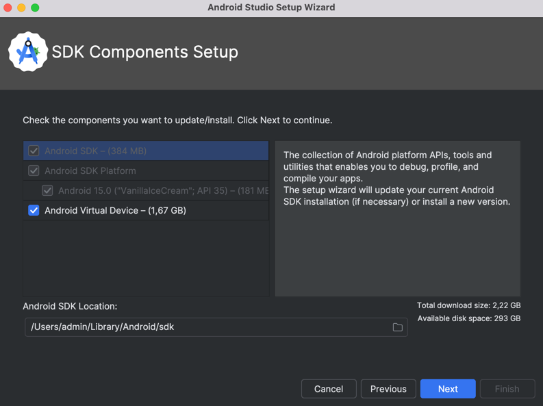
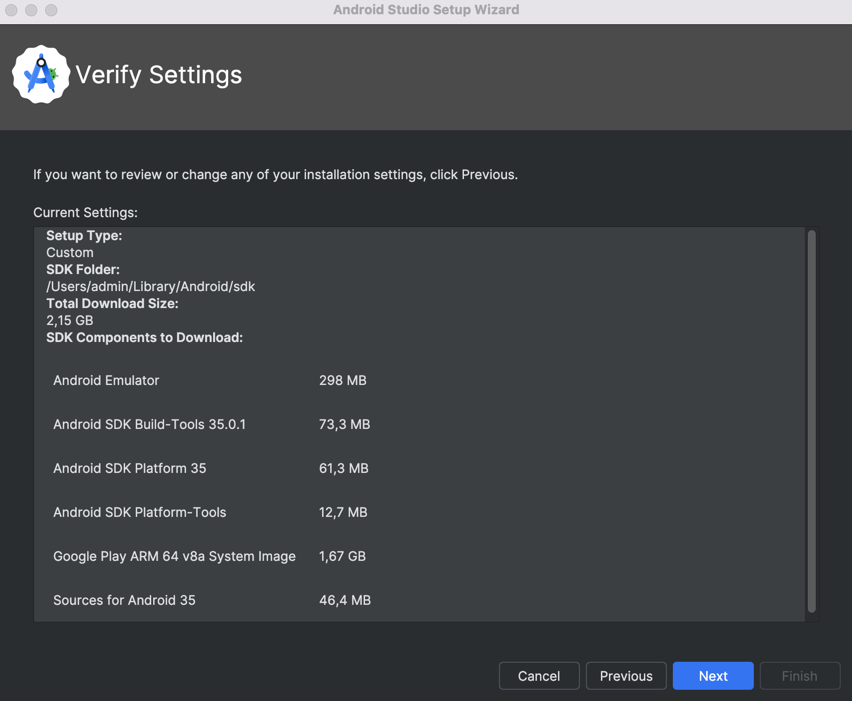
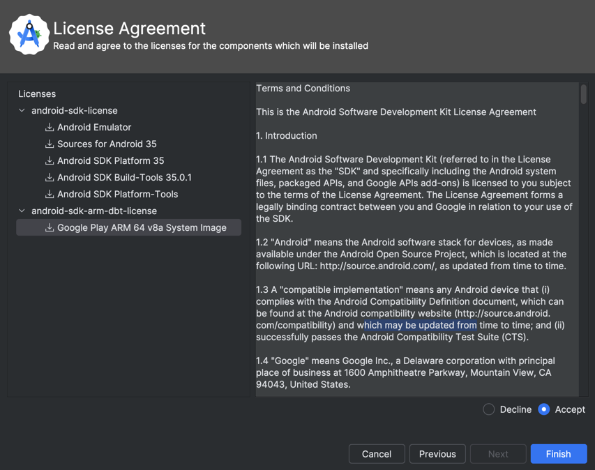

# Android

> Install [JDK](jdk) (I.e. Corretto) before proceeding.

## Android Studio

Installed via Jetbrains Toolbox

### Initialization

### Pair Devices Using Wi-Fi

#### Mac

* System Settings -> Privacy & Security -> Local Network -> Android Studio ☑

> This will allow Android Studio to search for devices in your network.

#### Android

* Developer options -> Wireless debugging -> Pair device with pairing code

> You will receive a code to use in Android Studio for connecting your device. If needed, you can remove the paired device later.

> Once the connection is established, you can run your app directly from the IDE onto the device.

> If you turn off wireless debugging and enable it again, you will be able to seamlessly run the app on your device once more.

#### Android Studio

Pair Devices Using Wi-Fi -> Pair using pairing code -> PAIR

> The connection may take anywhere from 2 to 4 minutes. Make sure to keep the screens active on both the IDE and your device during this time.
