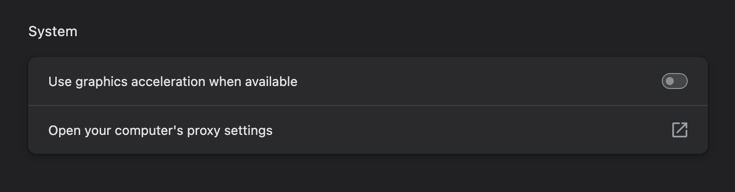

# Chrome

## Settings

### Disable Hardware Acceleration

Disabling hardware acceleration can help resolve:
- Video playback issues or screen sharing problems
- Performance issues on certain systems

## Extensions

### Privacy & Security

- [Adblock Plus - free ad blocker](https://adblockplus.org/de/)
- [Privacy Badger by Electronic Frontier Foundation](https://chromewebstore.google.com/publisher/electronic-frontier-found/uee155fce3653042847650b96a629f468)
- [Consent-O-Matic - Automatic handling of GDPR consent forms](https://chromewebstore.google.com/detail/consent-o-matic/mdjildafknihdffpkfmmpnpoiajfjnjd)
- [Cookie-Editor](https://cookie-editor.com/)
- [Clear Site Data by guokai.dev](https://chromewebstore.google.com/detail/clear-site-data/aihgofjefdlhpnmeakpnjjeajofpcbhj)
- [Clear Cache by Little Void LLC](https://chromewebstore.google.com/detail/clear-cache/cppjkneekbjaeellbfkmgnhonkkjfpdn)

### Developer Tools

- [React Developer Tools](https://chromewebstore.google.com/detail/react-developer-tools/fmkadmapgofadopljbjfkapdkoienihi)
- [Redux DevTools](https://chromewebstore.google.com/detail/redux-devtools/lmhkpmbekcpmknklioeibfkpmmfibljd)
- [Vue.js devtools](https://chromewebstore.google.com/detail/vuejs-devtools/nhdogjmejiglipccpnnnanhbledajbpd)
- [JSON Formatter by callumlocke.com](https://chromewebstore.google.com/detail/json-formatter/bcjindcccaagfpapjjmafapmmgkkhgoa)
- [GitHub Raw to CDN Converter](https://chromewebstore.google.com/detail/github-raw-to-cdn-convert/ffggbcmkdfdjjmpbgacfgfnbogcikeac)

### Writing & Productivity

- [Grammarly: AI Writing Assistant](https://chromewebstore.google.com/detail/grammarly-ai-writing-assi/kbfnbcaeplbcioakkpcpgfkobkghlhen)
- [Ddict: AI Translation & Writing Assistant by ddict.me](https://chromewebstore.google.com/detail/ddict-ai-translation-writ/bpggmmljdiliancllaapiggllnkbjocb)
- [Free Auto Text Expander for Google Chrome™](https://chromewebstore.google.com/detail/free-auto-text-expander-f/dnppahfbgjfocdedfhmgclgpicenjolg)
- [Lightning Autofill](https://chromewebstore.google.com/detail/lightning-autofill/nlmmgnhgdeffjkdckmikfpnddkbbfkkk)

### YouTube

- [Focused Youtube by makaroni4.com](https://chromewebstore.google.com/detail/focused-youtube/nfghbmabdoakhobmimnjkamfdnpfammn)
- [YouTube Subtitle Downloader by antonkhoteev.com](https://chromewebstore.google.com/detail/youtube-subtitle-download/mjmghnkcbdmdbkolinkcbapglcinoahd)
- [TubeBuddy for YouTube™](https://chromewebstore.google.com/detail/tubebuddy-for-youtube/mhkhmbddkmdggbhaaaodilponhnccicb)
- [Zoom to Fill - Ultrawide Video](https://chromewebstore.google.com/detail/zoom-to-fill-ultrawide-vi/adpjimagbfpknkodpofjphpbdlfkeiho)

### Web Enhancement

- [Weava Highlighter - PDF & Web by Weavatools Limited](https://chromewebstore.google.com/detail/weava-highlighter-pdf-web/cbnaodkpfinfiipjblikofhlhlcickei)
- [Take Webpage Screenshots Entirely - FireShot](https://chromewebstore.google.com/detail/take-webpage-screenshots/mcbpblocgmgfnpjjppndjkmgjaogfceg)
- [PrintFriendly - Print, PDF, and Screenshot](https://chromewebstore.google.com/detail/printfriendly-print-pdf-a/ohlencieiipommannpdfcmfdpjjmeolj)
- [Mask & Blur Pro](https://chromewebstore.google.com/detail/mask-blur-pro/oiajbfjkcdmhppahnophhpaphoalhmam)
- [Auto Scroll Down](https://chromewebstore.google.com/detail/auto-scroll-down/lnagemjinihjlbhmohaaacdflafjdkmm)
- [Tab Hibernate](https://chromewebstore.google.com/detail/tab-hibernate/ammlihljcndoijbkoobiobhjgoopiidn)

### Business & Sales

- [GetProspect](https://getprospect.com/linkedIn-email-finder-chrome-extension)

### Shopping

- [Keepa™ - Amazon Price Tracker](https://keepa.com/)

### UI & Design

- [Atom Material Icons](https://chromewebstore.google.com/detail/atom-material-icons/pljfkbaipkidhmaljaaakibigbcmmpnc)

### Voice & AI

- [Speechify - Voice AI Assistant](https://chromewebstore.google.com/detail/speechify-%E2%80%94-voice-ai-assi/ljflmlehinmoeknoonhibbjpldiijjmm)
