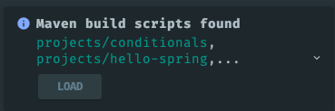

# IDE

## Common in PyCharm, Goland, and IntelliJ IDEA

### Restore Defaults

```File -> Manage IDE Settings -> Restore IDE Settings```

### Enable or Disable Sync

```Settings -> Settings Sync```

### Customizations

#### Settings

- Appearance & Behavior
  - Appearance
    - ☑ Use custom font: `Fira Code` | Size: `14`
  - New UI
    - ☑ Enable new UI
    - ☑ Compact mode
  - Editor
    - ☑ Change font size with Command+Mouse Wheel in:
      - All editors
    - Font
      - Font: `Fira Code`
      - Size: `14`
      - Line height: `1.2`
      - ☑ Enable ligatures
    - Color Scheme
      - Color Scheme Font
        - □ Use color scheme font instead of the default
      - Console Font
        - □ Use console font instead of the default
- Tools
  - Terminal
    - Cursor shape: `Vertical`
  - Actions on Save
    - ☑ Reformat code
    - ☑ Optimize imports
    - ☑ Rearrange code
    - ☑ Run code cleanup

#### Plugins

- [Atom Material Icons - Atom Material Themes & Plugins](https://plugins.jetbrains.com/plugin/10044-atom-material-icons)
- [Material Theme UI - Atom Material Themes & Plugins](https://plugins.jetbrains.com/plugin/8006-material-theme-ui)
- [.​env files support](https://plugins.jetbrains.com/plugin/9525--env-files-support)

#### Theme

- Material Oceanic

## IntelliJ IDEA

### Customizations

#### Settings

- Build
  - Compiler
    - ☑ Build project automatically 
  - Advanced Settings
    - ☑ Allow auto-make to start even if developed application is currently running

#### Load Maven Modules

* Clone the repository and open it with IDE and wait for sometime for the IDE to detect Maven modules.



* Click on `LOAD` to load all the projects.
* You can also load the projects manually.
  * Navigate to `Project Structure | Modules | + | Add | Import Module`
  * Select the project directory and load.

## WebStorm

### Customizations

#### Settings

- Editor
  - Code Style
    - HTML
      - Tab size: `2`
      - Indent: `2`
      - Continuation indent: `2`
    - JavaScript
      - Tab size: `2`
      - Indent: `2`
      - Continuation indent:`2`
    - Style Sheets
      - CSS
        - Tab size: `2`
        - Indent: `2`
        - Continuation indent: `2`
    - TypeScript
      - Tabs and Indents
        - Tab size: `2`
        - Indent: `2`
        - Continuation indent: `2`
      - Wrapping and Braces
        - Function declaration parameters
          - □ Align when multiline
- Languages & Frameworks
  - Node.js
    - ☑ Coding assistance for Node.js

### Debugging TypeScript

* Enable `sourceMap` and set the distribution output directory with `outDir` in the TS config file.
* Compile the code with tsc command.
* Select your breakpoints in the TS file.
* Select the corresponding JS file in the distribution output directory.
* Launch debug session by clicking on the 🐞 icon from the top right corner.
* It will start the debug session with TS file.

#### tsconfig.json

```json
{
  "compilerOptions": {
    "target": "es2016",
    "module": "commonjs",
    "rootDir": "./src",
    "sourceMap": true,
    "outDir": "./dist",
    "removeComments": true,
    "noEmitOnError": true
  }
}
```

#### Load JavaScript Project

* Clode the repository and copy to the project to a directory.
* Select project directory and select `Mark Directory as | Resource Root`.


